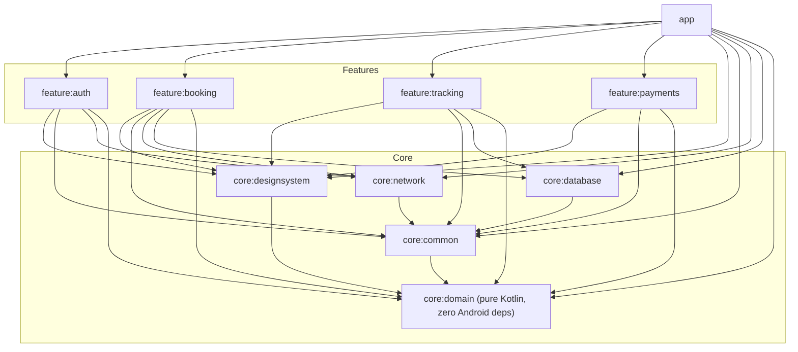

# RideFlow

A ride-hailing consumer Android app, built to demonstrate production-grade Clean Architecture + MVI in modern Kotlin/Compose — fully interactive with zero backend configuration.

## Tech stack

| Layer | Choice |
|---|---|
| Language | Kotlin 2.0.21 |
| UI | Jetpack Compose (Material 3), Compose BOM 2024.09.00 |
| Architecture | Clean Architecture (presentation → domain → data) + MVI |
| DI | Hilt 2.52 |
| Async | Kotlin Coroutines 1.9.0 + Flow |
| Networking | Retrofit 2.11.0, OkHttp 4.12.0, kotlinx.serialization 1.7.3 |
| Persistence | Room 2.6.1, DataStore Preferences 1.1.x |
| Navigation | Navigation-Compose 2.8.x |
| Images | Coil 2.7.0 |
| Static analysis | detekt, ktlint |
| CI | GitHub Actions |

## Key features

- **Phone + OTP authentication** with a simulated challenge/verify flow (demo code is always `1234`).
- **Ride booking**: saved-place picker, live fare estimation across four vehicle tiers, and a simulated driver-matching state machine (searching → assigned → arrived).
- **Live trip tracking**: a custom Canvas-drawn map animates the driver from pickup to dropoff, with live ETA and progress.
- **Pluggable payments**: a provider-agnostic `PaymentGateway` interface with three interchangeable fake implementations (card, wallet, pay-later), selected via Hilt multibinding.
- **Custom Canvas map**: a stylized road grid, route line, pickup/dropoff pins and an animated, heading-aware driver marker — no Google Maps API key required.
- **Rider profile** with sign-out, completing the auth → booking → tracking → payments → profile flow.

## Architecture



Every arrow points inward or sideways toward `core:domain`, which has **zero Android imports** — it is a pure Kotlin/JVM module. No feature module depends on another feature module; hand-offs between them (e.g. booking → tracking) happen through plain callback lambdas wired together once, in the app module's `RideFlowNavGraph`.

### Module structure

```
rideflow-android/
├── app/                        Application shell, nav graph, profile screen
├── core/
│   ├── designsystem/           Material3 theme, tokens, reusable Composables, Canvas map
│   ├── common/                 NetworkResult, DispatcherProvider, MVI base classes
│   ├── network/                Retrofit/OkHttp, DTOs, auth interceptor
│   ├── database/               Room entities, DAOs
│   └── domain/                 Models, repository interfaces, use cases (pure Kotlin)
└── feature/
    ├── auth/                   Login + OTP verification
    ├── booking/                Home/map, fare estimation, driver matching
    ├── tracking/                Live trip tracking
    └── payments/               Payment method selection, PaymentGateway abstraction
```

## Architecture decisions

**Why Clean Architecture + MVI.** Every feature ViewModel exposes an immutable `UiState` via `StateFlow`, accepts a sealed `UiIntent` through one entry point, and emits one-shot `UiEffect`s (navigation, snackbars) through a `Channel` — the same unidirectional-data-flow shape used across a production ride-hailing app's ~30 screens. Keeping `core:domain` free of Android imports means every use case and repository interface is trivially unit-testable on the JVM, and the dependency rule (outer layers depend inward, never the reverse) is enforced by the module graph itself, not just convention.

**Why the fake-repository pattern.** There is no real RideFlow backend, and this is a portfolio project, not a production service — so every repository interface in `core:domain` is backed by a fully simulated implementation with realistic latency, occasional failures, and a deterministic driver/fare catalogue, letting the app run and feel real with zero configuration. `core:network`'s Retrofit service, DTOs, and (for auth/booking) a complete `Real*Repository` are still fully wired against a placeholder base URL, to demonstrate exactly how a real backend integration would be substituted — a build-config flag is all that separates them.

**Why a custom Canvas map instead of Google Maps.** A stylized, self-drawn map (procedural road grid, route line, animated driver marker) needs no API key and no network access, so the app works immediately for anyone who clones it, while still showing real `Canvas`/`DrawScope` skill.

This project uses fictional branding; it demonstrates the same architectural patterns and engineering practices used professionally in production ride-hailing apps at scale (5M+ downloads, 1M+ active users).

### Deliberate simplifications

- **Payments are fake-only.** A real payment integration always sits behind a specific, named SDK; this project intentionally never names or depends on one, so there is no `RealPaymentRepository` — only the three fake `PaymentGateway` implementations behind the shared interface.
- **Tracking is fake-only.** A production driver-location stream would be a WebSocket or push channel, not a Retrofit polling endpoint, so it doesn't fit the same real/fake toggle used by auth and booking.
- **Booking ↔ tracking hand-off goes through a local Room row**, not a direct module dependency — `RideHistoryEntity` is written by booking and read by tracking, mirroring how two features in a large app share a local cache rather than depending on each other directly.
- **Navigation arguments are typed, constant-keyed primitives** (`NavType.StringType` / `FloatType`) rather than the newer kotlinx.serialization-based type-safe routes introduced in Navigation 2.8, to keep every route resolvable without relying on a specific serializer-generation behavior this environment couldn't build-verify.
- **Saved payment methods and driver profiles are in-memory**, not persisted across process death, since they're demo fixtures rather than user data that needs to survive a restart.

## Getting started

1. Clone the repository.
2. Open it in **Android Studio Ladybug (2024.2.1) or newer**.
3. Let Gradle sync — no API keys, secrets, or backend configuration are required.
4. Run the `app` configuration on an emulator or device (minSdk 26).

The app boots straight into a working login flow (any phone number, code `1234`), through booking, live tracking, and payment — all against realistic simulated data.

## License

MIT — see [LICENSE](LICENSE).
